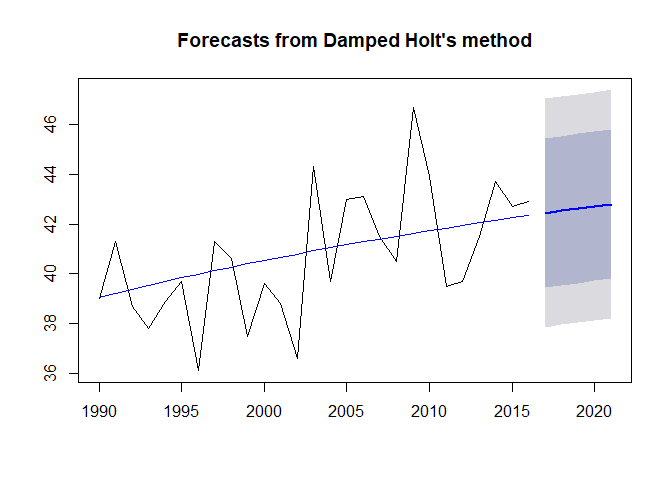

# Question 1: Brief Financial Data
Natively  in  R,  you  have  access  to  sample  data  sets  of  prominent  stocks  over  time.    We'll  be  using  EuStockMarkets  for  this  question.    Type  help(EuStockMarkets)  to  learn  more.    From  these  data,  pull  specifically  the  DAX  index.For  all  questions  in  this  assignment,  you're  welcome  to  normalize  (or  don't!)  how  you  see  fit,  but,  if  you  choose  to,  please  document  what  you're  doing  and  why  for  the  grader.It's  not  necessary  forthe  purpose  of  this  assignment.

a) Obtain the DAX Index from EuStockMarkets dataset


```r
dax <- EuStockMarkets[,"DAX"]
str(dax)
```

```
##  Time-Series [1:1860] from 1991 to 1999: 1629 1614 1607 1621 1618 ...
```

### b)These  are  annual  European  Stock  Data  from  1990  onward.    Create  a  rudimentary  plot  of  the  data.    Make  the  line  blue.    Give  an  informative  title.    Label  the  axes  accurately.    In  1997,  an  event  happened  you  want  to  indicate;  add  a  vertical  red  line  to  your  plot  which  divides  pre-1997  and  post-1997  information.


```r
plot(
    dax,
    main="EU DAX Index from complete series",
    xlab="Year",
    ylab="Index Price",
    col="blue"
)
abline(
    v=1997,
    color="red"
)
```

```
## Warning in int_abline(a = a, b = b, h = h, v = v, untf = untf, ...):
## "color" is not a graphical parameter
```

<!-- -->

### c) Decompose  the  time  series  into  its  components  (i.e.,  trend,  seasonality,  random).    Keep  in  mind  that  this  is  a  multiplicative  model  you  want.    Create  a  plot  of  all  decomposed  components.    As  before,  make  all  lines  blue  and  have  a  vertical  divider  at  the  year  1997.


```r
dax.decompose.multi <- decompose(dax,type="multiplicative")
plot(dax.decompose.multi,col="blue")
abline(
    v=1997,
    col="red"
)
```

<!-- -->

# Question 2: Temperature Data
### a) Using  the  maxtemp  datasetgranted  by  loading  fpp2,  there  are  maximum  annual  temperature  data  in  Celsius.    For  more  information,  use  help(maxtemp).    To  see  what  you're  looking  at,  execute  the  command  in  'Examples'  in  the  help  document


```r
autoplot(maxtemp)
```

<!-- -->

### b) We  are  only  concerned  with  information  after  1990.    Please  eliminate  unwanted  information  or  subset  information  we  care  about


```r
temps <- window(maxtemp, start = 1990)
```

### c) Utilize  SES  to  predict  the  next  five  years  of  maximum  temperatures  in  Melbourne.    Plot  this  information,  including  the  prior  information  and  the  forecast.    Add  the  predicted  value  line  across  1990-present  as  a  separate  line,  preferably  blue.    So,  to  review,  you  should  have  your  fit,  the  predicted  value  line  overlaying  it,  and  a  forecast  
2through  2021,  all  on  one  axis.  Find  the  AICc  of  this  fitted  model.    You  will  use  that  information  later.


```r
temps.ses <- ses(temps, h=5)
plot(temps.ses)
lines(temps.ses$fitted,col="blue")
```

<!-- -->

```r
temps.ses$model$aicc
```

```
## [1] 141.5302
```

### d) Now  use  a  dampedHolt'slinear  trend  to  also  predict  out  five  years.Make  sure  initial="optimal."    As  above,  create  a  similar  plot  to  1C,  but  use  the  Holt  fit  instead.


```r
temps.holt <- holt(temps, h=5, damped = TRUE, inital = "optimal")
plot(temps.holt)
lines(temps.holt$fitted,col="blue")
```

<!-- -->

```r
temps.holt$model$aicc
```

```
## [1] 145.5865
```

### e) Compare  the  AICc  of  the  ses()  and  holt()  models.    Which  model  is  better  here?


```r
temps.ses$model$aicc
```

```
## [1] 141.5302
```

```r
temps.holt$model$aicc
```

```
## [1] 145.5865
```

SES comprises the best model.

# Question 3: The Wands Choose the Wizard
### a) Utilize  the  dygraphslibrary.    Read  in  both  Unit11TimeSeries_Ollivander  and  _Gregorovitch.csv as  two  different  data  frames.    They  do  not  have  headers,  so  make  sure  you  account  for  that.This  is  a  time  series  of  Wands  sold  over  years


```r
gregorovitch <- read.csv("Unit11TimeSeries_Gregorovitch.csv")
ollivander <- read.csv("Unit11TimeSeries_Ollivander.csv")

names(gregorovitch) <- c("year","wands_sold")
names(ollivander) <- c("year","wands_sold")

str(gregorovitch)
```

```
## 'data.frame':	47 obs. of  2 variables:
##  $ year      : Factor w/ 47 levels "1/1/1971","1/1/1972",..: 1 2 3 4 5 6 7 8 9 10 ...
##  $ wands_sold: int  1295 1349 1298 1493 1432 1431 1291 1247 1403 1188 ...
```

```r
str(ollivander)
```

```
## 'data.frame':	47 obs. of  2 variables:
##  $ year      : Factor w/ 47 levels "1/1/1971","1/1/1972",..: 1 2 3 4 5 6 7 8 9 10 ...
##  $ wands_sold: int  1304 1168 1252 1296 1458 1443 1282 1450 1338 1063 ...
```

### b) You  don't  have  your  information  in  the  proper  format!    In  both  data  sets,  you'll  need  to  first  convert  the  date-like  variable  to  an  actual  Date  class.


```r
gregorovitch$year <- as.Date(gregorovitch$year, "%m/%d/%Y")
ollivander$year <- as.Date(gregorovitch$year, "%m/%d/%Y")

str(gregorovitch)
```

```
## 'data.frame':	47 obs. of  2 variables:
##  $ year      : Date, format: "1971-01-01" "1972-01-01" ...
##  $ wands_sold: int  1295 1349 1298 1493 1432 1431 1291 1247 1403 1188 ...
```

```r
str(ollivander)
```

```
## 'data.frame':	47 obs. of  2 variables:
##  $ year      : Date, format: "1971-01-01" "1972-01-01" ...
##  $ wands_sold: int  1304 1168 1252 1296 1458 1443 1282 1450 1338 1063 ...
```

### c) Use  the  library  xts  (and  the  xts()  function  in  it)  to  make  each  data  frame  an  xts  object  (effectively,  a  time  series).    You'll  want  to order.by the  Date  variable.


```r
gregorovitch.ts <- xts(gregorovitch$wands_sold, order.by=gregorovitch$year)
ollivander.ts <- xts(ollivander$wands_sold, order.by=ollivander$year)
str(gregorovitch.ts)
```

```
## An 'xts' object on 1971-01-01/2017-01-01 containing:
##   Data: int [1:47, 1] 1295 1349 1298 1493 1432 1431 1291 1247 1403 1188 ...
##   Indexed by objects of class: [Date] TZ: UTC
##   xts Attributes:  
##  NULL
```

```r
str(ollivander.ts)
```

```
## An 'xts' object on 1971-01-01/2017-01-01 containing:
##   Data: int [1:47, 1] 1304 1168 1252 1296 1458 1443 1282 1450 1338 1063 ...
##   Indexed by objects of class: [Date] TZ: UTC
##   xts Attributes:  
##  NULL
```

### d) Bind  the  two  xts  objects  together  and  create  a  dygraph  from  it.Utilize  the  help()  index  if  you're  stuck


```r
wands.sold <- merge(gregorovitch.ts,ollivander.ts)

dygraph(wands.sold,main="Olivander vs. Gregorovitch Wand Sales",xlab="Year",ylab="Sales") %>%
    dySeries("ollivander.ts", label="Gregorovitch", col="red") %>%
    dySeries("gregorovitch.ts", label="Ollivander",col="blue") %>%
    dyRangeSelector() %>%
    dyShading(from="1995-01-01",to="1999-01-01") %>%
    dyHighlight(highlightSeriesOpts = list( strokeWidth = 3 ) )
```

<!--html_preserve--><div id="htmlwidget-c8104ccc11c62de56fe7" style="width:672px;height:480px;" class="dygraphs html-widget"></div>
<script type="application/json" data-for="htmlwidget-c8104ccc11c62de56fe7">{"x":{"attrs":{"title":"Olivander vs. Gregorovitch Wand Sales","xlabel":"Year","ylabel":"Sales","labels":["year","Gregorovitch","Ollivander"],"legend":"auto","retainDateWindow":false,"axes":{"x":{"pixelsPerLabel":60}},"colors":["red","blue"],"series":{"Gregorovitch":{"axis":"y"},"Ollivander":{"axis":"y"}},"showRangeSelector":true,"rangeSelectorHeight":40,"rangeSelectorPlotFillColor":" #A7B1C4","rangeSelectorPlotStrokeColor":"#808FAB","interactionModel":"Dygraph.Interaction.defaultModel","highlightCircleSize":3,"highlightSeriesBackgroundAlpha":0.5,"highlightSeriesOpts":{"strokeWidth":3},"hideOverlayOnMouseOut":true},"scale":"yearly","annotations":[],"shadings":[{"from":"1995-01-01T00:00:00.000Z","to":"1999-01-01T00:00:00.000Z","color":"#EFEFEF","axis":"x"}],"events":[],"format":"date","data":[["1971-01-01T00:00:00.000Z","1972-01-01T00:00:00.000Z","1973-01-01T00:00:00.000Z","1974-01-01T00:00:00.000Z","1975-01-01T00:00:00.000Z","1976-01-01T00:00:00.000Z","1977-01-01T00:00:00.000Z","1978-01-01T00:00:00.000Z","1979-01-01T00:00:00.000Z","1980-01-01T00:00:00.000Z","1981-01-01T00:00:00.000Z","1982-01-01T00:00:00.000Z","1983-01-01T00:00:00.000Z","1984-01-01T00:00:00.000Z","1985-01-01T00:00:00.000Z","1986-01-01T00:00:00.000Z","1987-01-01T00:00:00.000Z","1988-01-01T00:00:00.000Z","1989-01-01T00:00:00.000Z","1990-01-01T00:00:00.000Z","1991-01-01T00:00:00.000Z","1992-01-01T00:00:00.000Z","1993-01-01T00:00:00.000Z","1994-01-01T00:00:00.000Z","1995-01-01T00:00:00.000Z","1996-01-01T00:00:00.000Z","1997-01-01T00:00:00.000Z","1998-01-01T00:00:00.000Z","1999-01-01T00:00:00.000Z","2000-01-01T00:00:00.000Z","2001-01-01T00:00:00.000Z","2002-01-01T00:00:00.000Z","2003-01-01T00:00:00.000Z","2004-01-01T00:00:00.000Z","2005-01-01T00:00:00.000Z","2006-01-01T00:00:00.000Z","2007-01-01T00:00:00.000Z","2008-01-01T00:00:00.000Z","2009-01-01T00:00:00.000Z","2010-01-01T00:00:00.000Z","2011-01-01T00:00:00.000Z","2012-01-01T00:00:00.000Z","2013-01-01T00:00:00.000Z","2014-01-01T00:00:00.000Z","2015-01-01T00:00:00.000Z","2016-01-01T00:00:00.000Z","2017-01-01T00:00:00.000Z"],[1304,1168,1252,1296,1458,1443,1282,1450,1338,1063,1230,1237,1291,1211,1442,1649,1629,1260,1283,1617,1284,1399,1272,1297,1666,1797,1620,450,200,1308,1277,1444,1070,1031,1405,1487,1229,1493,1317,1520,1337,1547,1632,1336,1289,1439,1226],[1295,1349,1298,1493,1432,1431,1291,1247,1403,1188,1555,1512,1552,1023,1190,1197,1120,1119,1319,1692,1452,1494,1346,1519,1580,1623,1863,0,845,858,814,869,864,942,837,838,671,425,634,618,404,758,410,510,103,49,70]]},"evals":["attrs.interactionModel"],"jsHooks":[]}</script><!--/html_preserve-->
